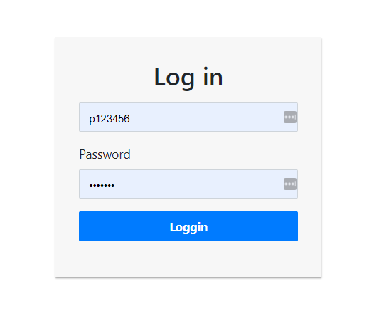

# Creating ReactJS forms with Formik & Yup

### Makes the React Application run
```js
// adding react-formik package. Using app based on [Create React App](https://github.com/facebook/create-react-app)
npx create-react-app react-formik
cd react-formik

// using yarn
npm install -g yarn

// we are going to need bootstrap
yarn add bootstrap

// adding basic styling
// adding yup form validation
yarn add formik styled-components yup

// start yarn
yarn start

// open browser to
open http://localhost:3000/
```

### Formik
#### What Formik does:
- Getting state values
- Validation and error messages
- Handling form submission on Form

#### What Formik provides out of the box:
Formik provides: Formik, Form, Field, and ErrorMessage.

#### How can I use Formik:

Just wrap the Form component inside Formik component:
```js
<Formik>
  <Form>
    {/* here will be dragons */}
  </Form>
</Formik>
```


### What `Yup` does:
Yup is an object schema validator. Simple put it is a library that allows you to <b>define the blueprint of a JS object</b> and ensure that the object values match that blueprint through the validation process.

### Custom and predefined fields
Formik provided pre-defined Fields out of the box, we will implement it and also create a new Custom field to compare both options

### Schemas
Finally we will set a blueprint of the JS object in a object. So we can later on re-use it.

### DEMO Screenshot




### Further information
Thanks to Jared Palmer for this great tool, further information: [react-hook-form](https://react-hook-form.com/)

---
### :100: <i>Thanks!</i>
#### Now, don't be an stranger. Let's stay in touch!

<a href="https://www.linkedin.com/in/leolanese/"> 
  
</a>

##### :radio_button: linkedin: <a href="https://www.linkedin.com/in/leolanese/" target="_blank">@LeoLanese</a>
##### :radio_button: Twitter: <a href="https://twitter.com/LeoLanese" target="_blank">@LeoLanese</a>
##### :radio_button: Portfolio: <a href="https://www.leolanese.com" target="_blank">www.leolanese.com</a>
##### :radio_button: DEV.to: <a href="https://www.dev.to/leolanese" target="_blank">dev.to/leolanese</a>
##### :radio_button: Blog: <a href="https://www.leolanese.com/blog" target="_blank">leolanese.com/blog</a>
##### :radio_button: Questions / Suggestion / Recommendation: developer@leolanese.com
